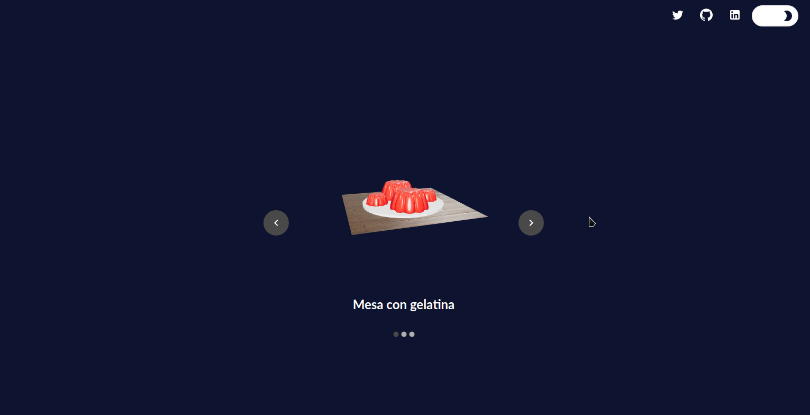

[![Contributors][contributors-shield]][contributors-url]
[![Forks][forks-shield]][forks-url]
[![Stargazers][stars-shield]][stars-url]
[![LinkedIn][linkedin-shield]][linkedin-url]

<br />
<p align="center">
  <a>
    
  </a>

  <h3 align="center">Augmented reality</h3>

  <p align="center">
    Personal project where <a href="https://github.com/alicia-granados" target="_blank">alicia-granados</a> and I will be using javascript to experiment with augmented reality on <a  target="_blank" href="https://sudo-von.github.io/augmented-reality-javascript/">https://sudo-von.github.io/augmented-reality-javascript/</a>.
    <br />
    <br />
    <a href="https://github.com/sudo-von/augmented-reality-javascript"><strong>Explore the docs »</strong></a>
    <br />
    ·
    <a href="https://github.com/sudo-von/augmented-reality-javascript/issues">Report Bug</a>
    ·
    <a href="https://github.com/sudo-von/augmented-reality-javascript/issues">Request Feature</a>
  </p>
</p>

<details open="open">
  <summary>Table of Contents</summary>
  <ol>
    <li>
      <a href="#about-the-project">About The Project</a>
      <ul>
        <li><a href="#website-preview">Website preview</a></li>
        <li><a href="#built-with">Built With</a></li>
        <li><a href="#prerequisites">Prerequisites</a></li>
        <li><a href="#installation">Installation</a></li>
      </ul>
    </li>
    <li><a href="#usage">Usage</a></li>
    <li><a href="#scalability">Scalability</a></li>
    <li><a href="#contributing">Contributing</a></li>
    <li><a href="#license">License</a></li>
    <li><a href="#contact">Contact</a></li>
  </ol>
</details>


<!-- ABOUT THE PROJECT -->
## About The Project

<a href="https://github.com/alicia-granados" target="_blank">alicia-granados</a> and I wanted to develop this project using Javascript and Blender, so we looked for a library that would allow us to use Blender's models to be able to render them on a website, that's how we found the Google model viewer library.
So, using Google model viewer and ReactJS we achieve this result where we developed and sold out an "idea" for a furniture store to show the models of the catalogues using augmented reality, in this way the people could look the models in their homes instead of exposing them to coronavirus.
We make the website responsive for all the screen resolutions and added a dark mode theme. Also, this models work for computer, android and IOS.
## Website preview
##### Desktop



##### Mobile [Android]


##### Mobile [iOS]


### Built With

* [Javascript](https://developer.mozilla.org/es/docs/#/JavaScript)
* [NodeJS](https://nodejs.org/es/)
* [NPM](https://www.npmjs.com/)
* [ReactJS](https://reactjs.org/)
* [MaterialUI](https://material-ui.com/)
* [StyledComponents](https://styled-components.com/)
* [Blender](https://www.blender.org/)
* [ModelViewer](https://modelviewer.dev/)

### Prerequisites

* git
* node
* npm

## Installation

1. Clone the repo.
   ```sh
   git clone https://github.com/sudo-von/augmented-reality-javascript.git
   ```
2. Use npm install to install the dependencies.
    ```sh
    npm install
    ```

<!-- USAGE EXAMPLES -->
## Usage

Use npm start to start development mode.
```sh
npm start
```
Use npm build to generate the production bundle.
```sh
npm build
```

## Scalibility

If you want to add more piece of furnitures, just add a new json at the 
src/data/catalogue.json file and add the respectives models for ios/android at the public/assets folder. Also, you will be able to edit this json if you want to change some values.


<!-- CONTRIBUTING -->
## Contributing

Contributions are what make the open source community such an amazing place to be learn, inspire, and create. Any contributions you make are **greatly appreciated**.

1. Fork the Project
2. Create your Feature Branch (`git checkout -b feature/AmazingFeature`)
3. Commit your Changes (`git commit -m 'Add some AmazingFeature'`)
4. Push to the Branch (`git push origin feature/AmazingFeature`)
5. Open a Pull Request

<!-- LICENSE -->
## License

Distributed under the MIT License. See `LICENSE` for more information.

<!-- CONTACT -->
## Contact

| Email | sudo.von.contact@gmail.com |
--- | --- |

| Email | aliciagranados35@gmail.com |
--- | --- |


<!-- MARKDOWN LINKS & IMAGES -->
[contributors-shield]: https://img.shields.io/github/contributors/sudo-von/augmented-reality-javascript.svg?style=for-the-badge
[contributors-url]: https://github.com/sudo-von/augmented-reality-javascript/graphs/contributors
[forks-shield]: https://img.shields.io/github/forks/sudo-von/augmented-reality-javascript.svg?style=for-the-badge
[forks-url]: https://github.com/sudo-von/augmented-reality-javascript/network/members
[stars-shield]: https://img.shields.io/github/stars/sudo-von/augmented-reality-javascript.svg?style=for-the-badge
[stars-url]: https://github.com/sudo-von/augmented-reality-javascript/stargazers
[issues-shield]: https://img.shields.io/github/issues/sudo-von/augmented-reality-javascript.svg?style=for-the-badge
[issues-url]: https://github.com/sudo-von/augmented-reality-javascript/issues
[license-shield]: https://img.shields.io/github/license/sudo-von/augmented-reality-javascript.svg?style=for-the-badge
[license-url]: https://github.com/sudo-von/augmented-reality-javascript/blob/master/LICENSE.txt
[linkedin-shield]: https://img.shields.io/badge/-LinkedIn-black.svg?style=for-the-badge&logo=linkedin&colorB=555
[linkedin-url]: https://www.linkedin.com/in/jes%C3%BAs-%C3%A1ngel-rodr%C3%ADguez-mart%C3%ADnez-84991a1b4/
